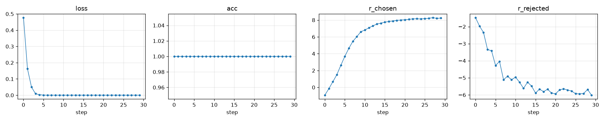
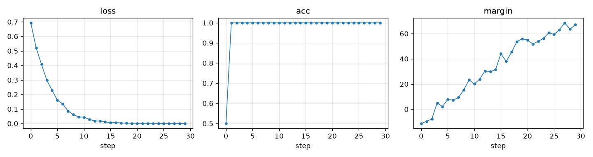

# nano-rl

A minimal, from-scratch RL stack for post-training small language models.

No TRL, no vLLM, no DeepSpeed. Just PyTorch and HuggingFace `transformers` for the
model itself, with a few hundred lines of readable code for everything else: a
hand-written inference engine, a small training loop, and the common RL algorithms
on top — PPO, GRPO, DPO, and reward modeling.

The codebase is small enough to read in full, and it learns: you can validate the
whole pipeline on a laptop in a couple of minutes and watch the curves move.

```
prompts ──▶ [ inference engine ] ──▶ rollouts ──▶ [ RL algorithm ] ──▶ loss ──▶ [ trainer ] ──▶ updated policy
             hand-written sampler        (reward + advantage)            AdamW step
```

## Design

Most RL-for-LLM codebases are production frameworks: fast, general, and hard to
learn from. `nano-rl` optimizes for the opposite — a reference implementation with
three decoupled subsystems you can understand in isolation:

| Subsystem | File | Responsibility | Independent of |
|---|---|---|---|
| Inference engine | `nanorl/inference.py` | batched autoregressive sampling with a KV cache | rewards, losses |
| Training system | `nanorl/trainer.py` | log-probs / entropy / values, backward, optimizer step | sampling, advantages |
| RL algorithms | `nanorl/rl/*.py` | reward, advantage estimation, the loss | token generation, gradient application |

The boundaries are intentional: the RL layer calls the engine to roll out and the
trainer to learn, and state does not leak across them.

## Quickstart

This trains a reward model and a DPO policy on a tiny 135M model, then plots the
curves — entirely on CPU, no GPU required.

```bash
# install (uv recommended; see Setup for pip/conda)
uv venv && uv pip install -e ".[viz]"

# run the end-to-end validation (downloads a ~135M model, CPU-only)
uv run scripts/quickstart.sh
```

Open the PNGs it prints. The reward model's loss should fall toward zero as the
chosen/rejected rewards separate, and DPO's preference margin should grow:

| Reward model | DPO |
|---|---|
|  |  |

```
reward model:  loss 0.48 -> 0.00   r_chosen -0.9 -> +8.2   r_rejected -1.5 -> -6.0
DPO:           loss 0.69 -> 0.0004  acc 0.50 -> 1.00         margin -11 -> +67
```

If those curves move, every layer of the stack — tokenization, the training loop,
the loss, the optimizer — is wired up correctly.

The quickstart uses a deliberately easy, learnable preference (a well-formed answer
vs. a non-answer) so the signal is unambiguous on a tiny model. The harder
"correct vs. wrong number" preference and the sampling-based algorithms are where a
GPU helps.

## What runs where

`nano-rl` is single-GPU and unsharded by design. The dividing line is sampling:
preference methods (DPO, reward modeling) only do forward/backward and run fine on
a laptop, while GRPO and PPO generate rollouts every step and benefit from a GPU.

| Task | Algorithm | Mac (CPU/MPS, 16GB) | GPU |
|---|---|:---:|:---:|
| Smoke tests (random tiny model) | all | seconds | yes |
| Reward modeling (135M) | Bradley-Terry | ~1 min | yes |
| DPO (135M) | DPO | ~1 min | yes |
| GRPO (Qwen2.5-0.5B) | GRPO | slow | recommended |
| PPO (Qwen2.5-0.5B) | PPO + value head | slow | recommended |

On a Mac, stay with the 135M model and the preference methods. For a 0.5B policy
with sampling, use the GPU path in [`scripts/vastai/`](scripts/vastai/), which wraps
reserving a box, running, pulling results, and shutting it down into a couple of
commands:

```bash
scripts/vastai/launch.sh                                  # reserve cheapest 24GB GPU
INSTANCE=$(cat .vast_instance_id) ALGO=grpo scripts/vastai/sync_and_run.sh
vastai destroy instance $(cat .vast_instance_id)          # release the instance
```

## Algorithms

| Algorithm | File | Summary | Requires |
|---|---|---|---|
| GRPO | `rl/grpo.py` | sample a group per prompt, advantage = group z-score, PPO-clip + KL-to-ref | policy + frozen ref |
| PPO | `rl/ppo.py` | actor-critic, GAE(λ), clipped policy + value loss, per-token KL reward | policy + value head + ref |
| DPO | `rl/dpo.py` | pairwise `-logσ(β·Δ(logπθ−logπref))`, no sampling, no reward model | policy + frozen ref |
| Reward model | `rl/reward_model.py` | scalar head, Bradley-Terry `-logσ(r⁺−r⁻)` | one model |

The default task is a fully offline synthetic arithmetic problem with a verifiable
reward (extract the `\boxed{}` answer and compare to ground truth), so the RL loop
has trustworthy signal with no dataset download. A GSM8K loader is included for real
data.

## Setup

uv (recommended):

```bash
# install uv once:  curl -LsSf https://astral.sh/uv/install.sh | sh
uv venv                          # creates .venv
uv pip install -e ".[viz]"       # core + plotting; add ,data for GSM8K
uv run python tests/test_smoke.py
```

pip / conda:

```bash
python -m venv .venv && source .venv/bin/activate
pip install -e ".[viz]"
python tests/test_smoke.py
```

The import package is `nanorl`. Smoke tests use a random-init tiny model and require
no download or GPU.

## Development

Linting and formatting use [ruff](https://docs.astral.sh/ruff/). A `Makefile` wraps
the common tasks:

```bash
make install   # install the package with dev + viz extras
make hooks     # install the pre-commit hooks (runs ruff on commit)
make lint      # check lint + formatting
make format    # auto-fix lint issues and format
make test      # run the CPU smoke tests
```

## Repository layout

```
nanorl/
  inference.py    InferenceEngine — hand-written batched sampler + KV cache
  trainer.py      Trainer — logprobs/entropy/values, backward, optim step
  models.py       load policy / frozen ref / value head / reward model
  data.py         arithmetic task, GSM8K loader, preference-pair builder
  rewards.py      verifiable reward functions
  utils.py        device/seed, masked ops, log-prob helpers
  rl/
    grpo.py  ppo.py  dpo.py  reward_model.py   common.py
examples/
  train_grpo.py  train_ppo.py  train_dpo.py  train_reward_model.py  plot.py
scripts/
  quickstart.sh           # CPU end-to-end validation + curves
  vastai/                 # one-command GPU runs on vast.ai
tests/
  test_smoke.py           # CPU end-to-end sanity for every subsystem
```

Every example takes `--model`, `--steps`, `--out`, and `--smoke` (random tiny model,
CPU). Metrics stream to `outputs/<algo>/metrics.jsonl`; `examples/plot.py` turns any
run into a PNG.

## Design notes & roadmap

See [`PLAN.md`](PLAN.md) for the design rationale and planned work (real Qwen runs,
LoRA, GSM8K evaluation, logging).

## Acknowledgements

Builds on the ideas in TRL, DeepSpeed-Chat, and the DeepSeekMath (GRPO),
PPO-for-RLHF, and DPO papers, trading their speed and generality for readability.
